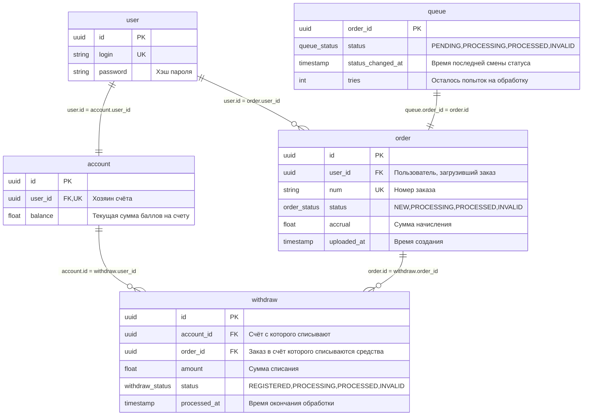
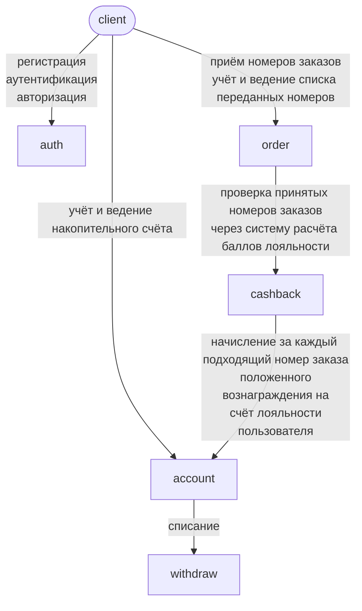
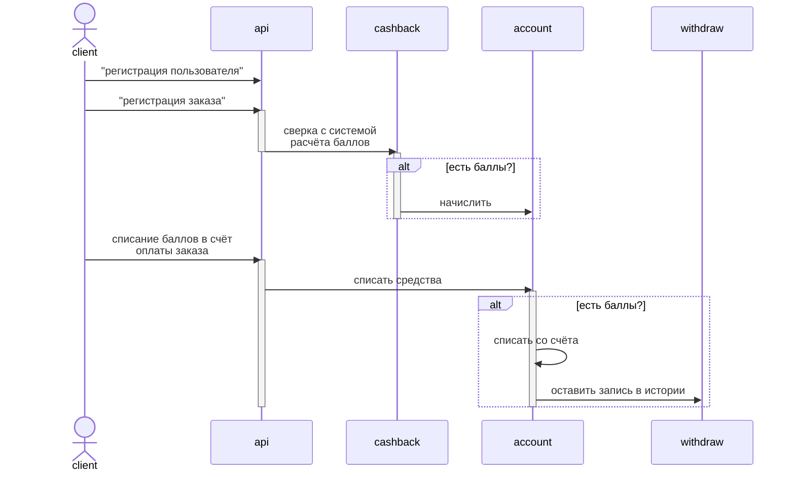
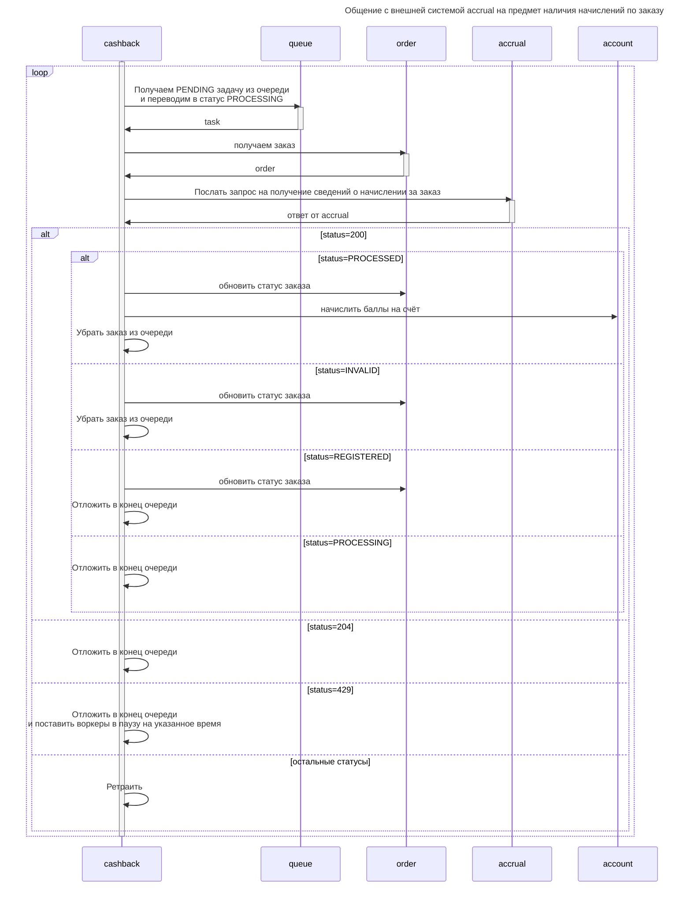
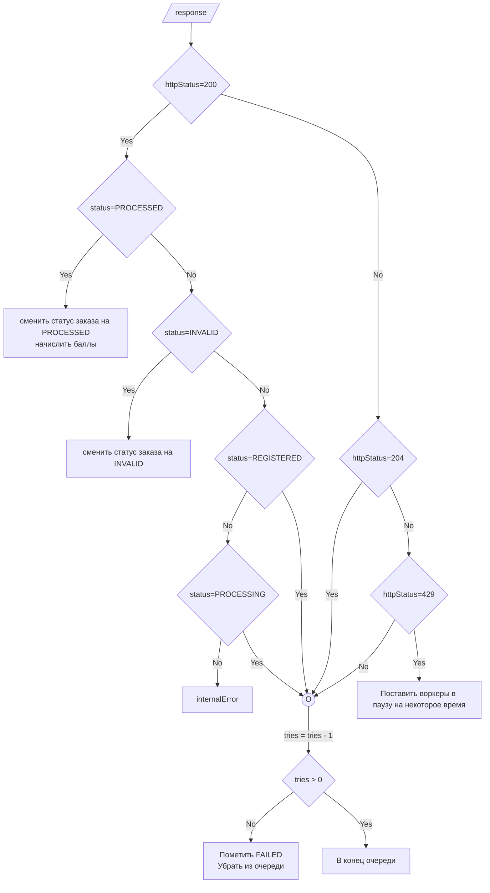

# Проект

# ER диаграмма



**Примечания к диаграмме**

1. Вместо `float` будет `decimal(20,2)`
2. queue_status, order_status и withdraw_status - type enum


# Взаимодействие в системе



# Абстрактная схема взаимодействия с системой


# Схема взаимодействия с системой начисления баллов




## Обработка ответа от accrual


# go-musthave-diploma-tpl

Шаблон репозитория для индивидуального дипломного проекта курса «Go-разработчик»

# Начало работы

1. Склонируйте репозиторий в любую подходящую директорию на вашем компьютере.
2. В корне репозитория выполните команду `go mod init <name>` (где `<name>` — адрес вашего репозитория на GitHub без
   префикса `https://`) для создания модуля

# Обновление шаблона

Чтобы иметь возможность получать обновления автотестов и других частей шаблона, выполните команду:

```
git remote add -m master template https://github.com/yandex-praktikum/go-musthave-diploma-tpl.git
```

Для обновления кода автотестов выполните команду:

```
git fetch template && git checkout template/master .github
```

Затем добавьте полученные изменения в свой репозиторий.
