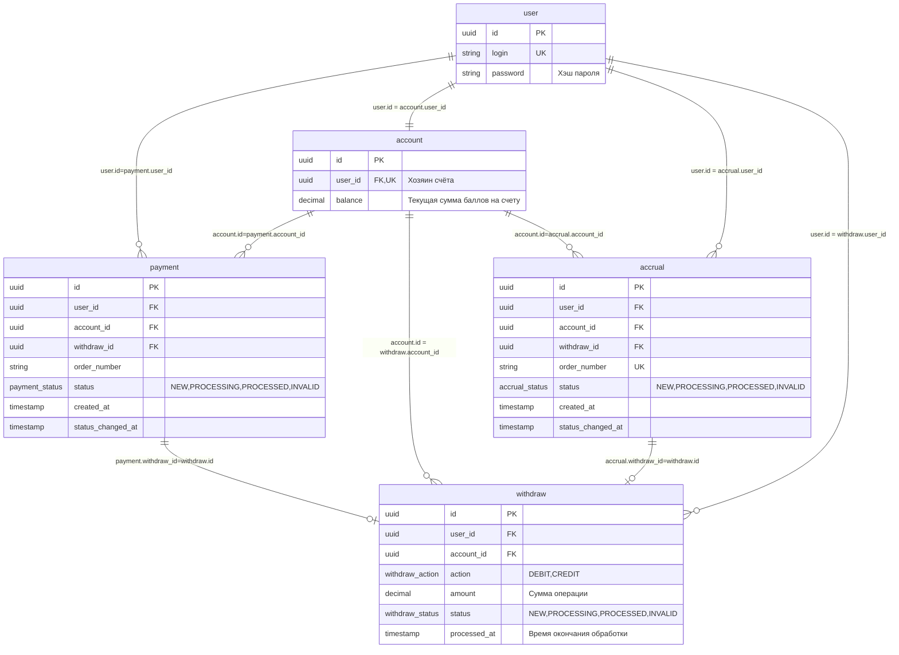
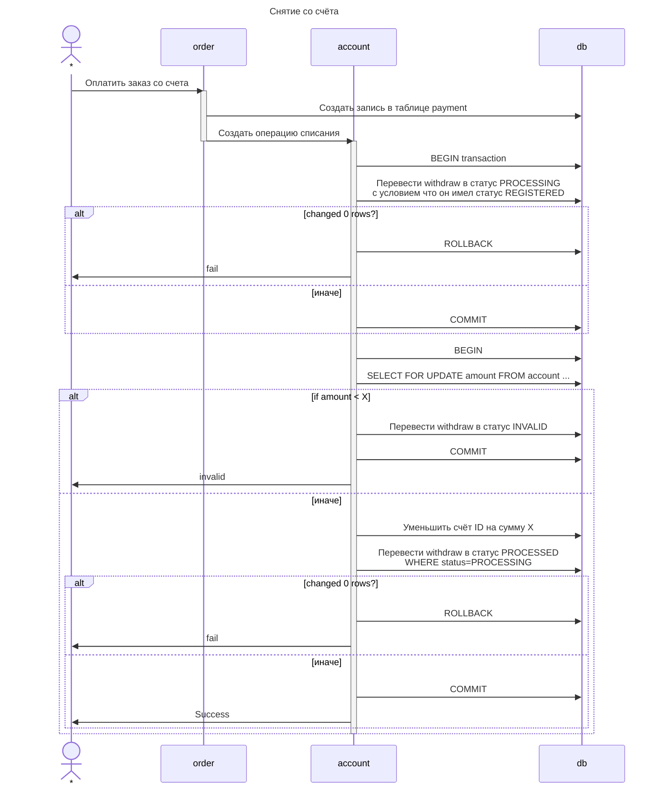
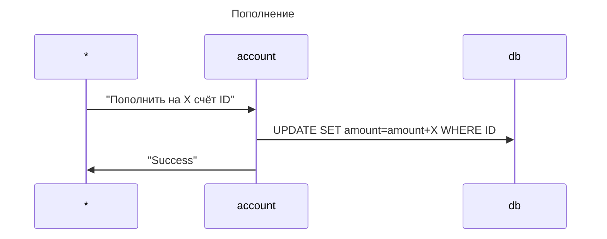
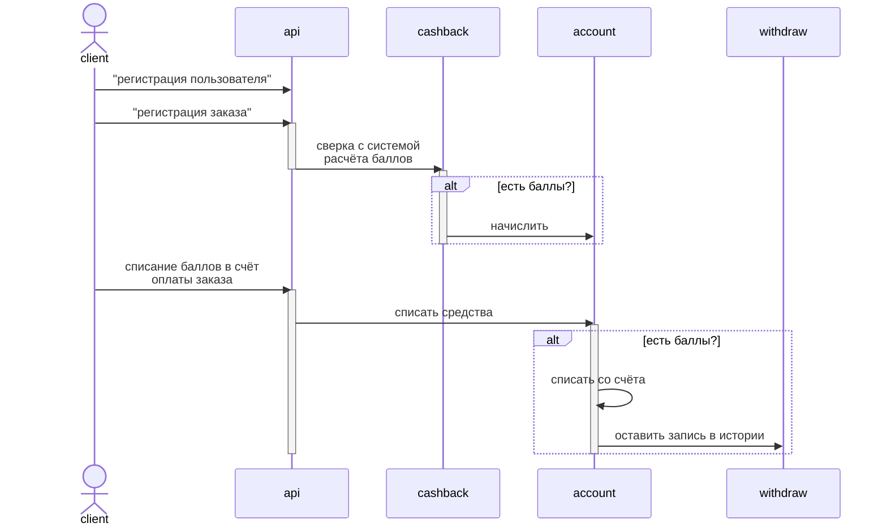
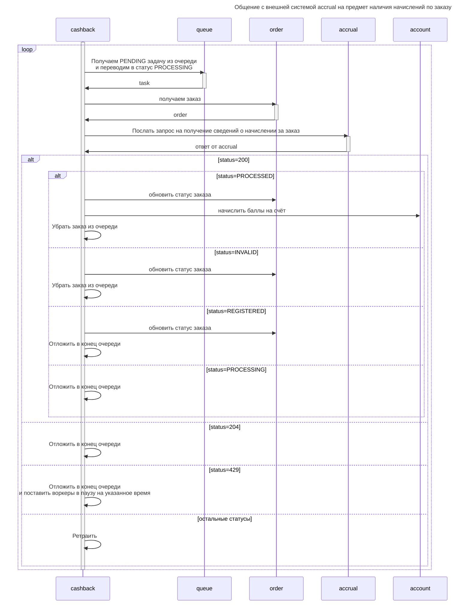
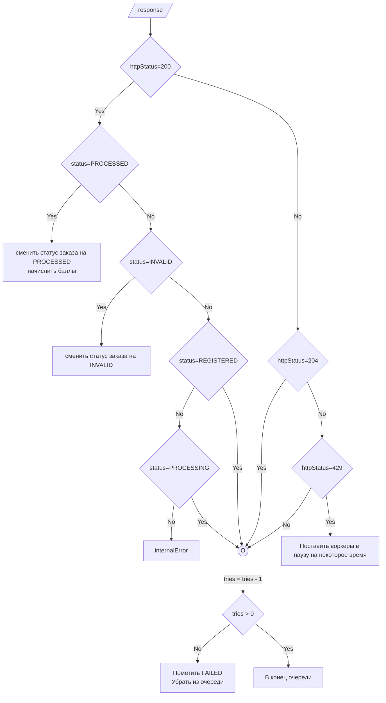

# RFC. Создание сервиса: Накопительная система лояльности «Гофермарт»

Данный проект носит учебный характер. Создаётся в целях
закрепления пройденного материала.

Нужно создать сервис накопительной системы лояльности по заданной [спецификации](./SPECIFICATION.md)

## Задача

Создать сервис который будет заниматься обслуживанием бонусных счетов пользователей.

Требования к сервису:

* Должна иметься регистрация новых пользователей
* Аутентификация зарегистрированных пользователей
* Взаимодействие с внешней системой расчета баллов за заказ
* Ведение счета зарегистрированного пользователя
  * Пополнение на величину выдаваемую внешним сервисом при регистрации заказа
  * Частичное или полное списание с бонусного счёта в оплату заказа
* Выдача величины текущего счета, статистики пополнений и расходов

## Предложеное решение

Создать сервис на языке Go.

Взаимодействие с клиентами осуществляется по REST API описанному в [спецификации](./SPECIFICATION.md)

В качестве хранилища данных использовать Postgres.

## Реализация

### Схема БД

Все денежные операции сосредоточены в таблицах счёта: `account` и переводов: `withdraw`. Денежные единицы хранятся в 
колонках с типом `decimal(20,2)`.

Таблицы `payment` и `accrual` хранят контекст переводов. Платежи и пополнения.

Информация о пользователе, хранится в таблице `user`. Все остальные таблицы ссылаются на `user` как на корень аггрегата,
дабы в будущем иметь удобный ключ шардирования, если вдруг всдумается раскидывать схему на шарды.

### Взаимодействие в системе

Взаимодействия клиента с компонентами системы можно видеть на следующей диаграме.

### Взаимодействие со счетом

Операции пополнения и снятия со счета похожи, и изображены на следующих диаграмах.

### Абстрактная схема взаимодействия с системой

### Схема взаимодействия с системой начисления баллов

### Обработка ответа от accrual

